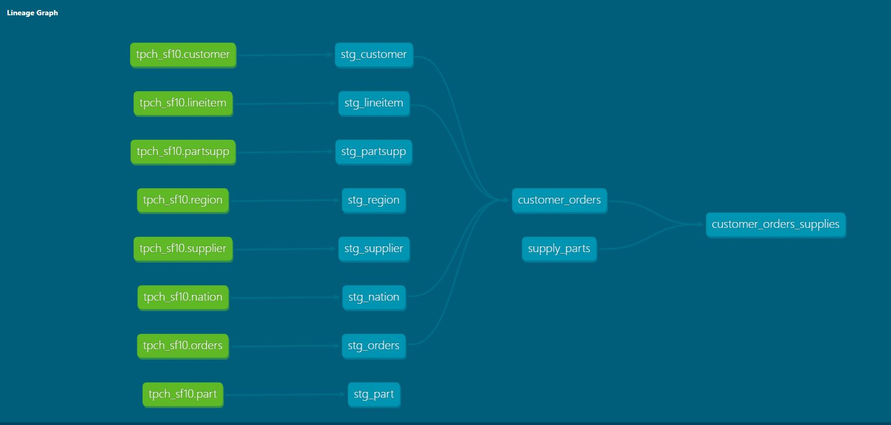

# Project description

The project is created on [Snowlflake sample database](https://docs.snowflake.com/en/user-guide/sample-data-tpch.html)' `SNOWFLAKE_SAMPLE_DATA.TPCH_SF10` for training purposes

Fact tables are modeled using star schema approach. Basic charts created in Snowflake Charts
Snowflake data are used as is, without any clean up

# Setup
Setup requires dbt with Snowflake connection and grants to use sample database
Scripts, except for dbt user creation, are provided in `/provision/snowflake_config.sql` 

# Data model
Data model graph generated by dbt 

