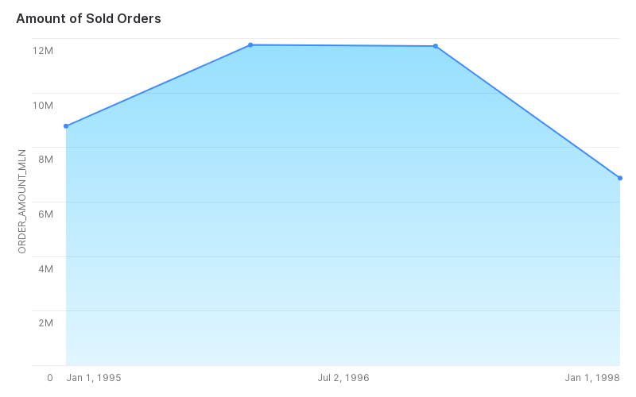
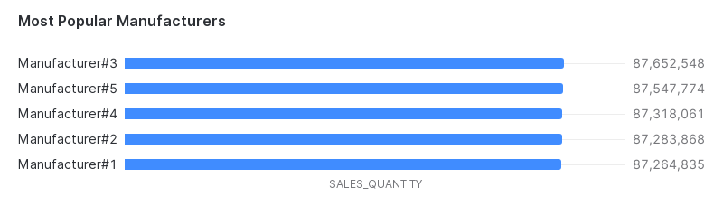
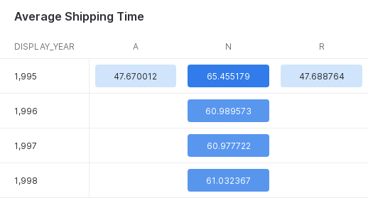
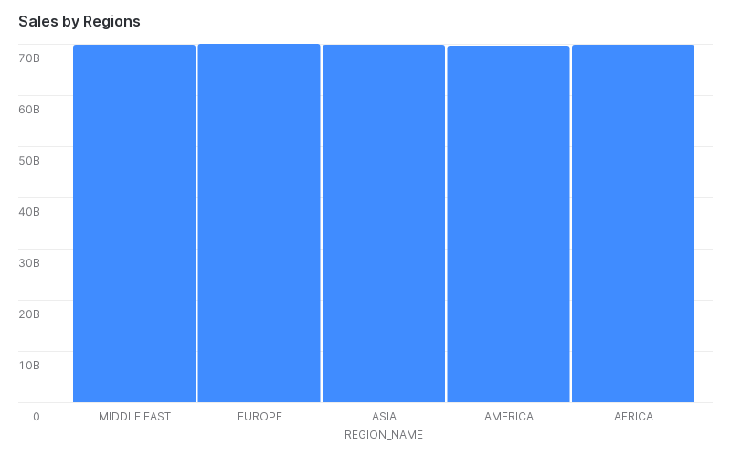

# Description
Charts prepared by queries to fact table `/models/core/facts/customer_orders_supplies.sql` and Snowflake Charts functionality
## Charts
### Yearly sales
The chart displays the amount of sold and not returned orders grouped by calendar year


### Best selling manufacturers
The sample data are almost homogeneous, so the chart is not very interesting, although we can notice slight differecences in number of sold goods shipped by air and mail


### Avg time to ship order by year
Surprisingly, active returns (A) and returned orders (R) show the list average shipping time (in days)


### Sales by Regions in 1996
Again, because of homogeneous data we see pretty similar sale results across the world


---
## Queries
### Yearly Sales
```
select
   extract('year', o_orderdate) as display_year
 , sum(coalesce(l_extendedprice, 0) * coalesce(l_quantity, 0) - coalesce(l_discount, 0)) as sales_amount
from customer_orders_supplies
where l_returnflag = 'N'
group by 1
```

### Best selling manufacturers
```
select
   c.p_mfgr
 , sum(coalesce(c.l_quantity, 0)) as sales_quantity
from customer_orders_supplies c
where c.l_shipmode in ('AIR', 'MAIL')
group by 1
order by 2 desc
```

### Average time to ship by year
```
select
   extract('year', o_orderdate) as display_year
 , l_returnflag  
 , avg(datediff('day', o_orderdate, l_shipdate)) as avg_ship_date
from customer_orders_supplies
where extract('year', o_orderdate) >= 1995
group by 1, 2
```

### Sales by Regions in 1996
```
select
   r.r_name as region_name
 , sum(coalesce(c.l_quantity, 0) * coalesce(c.p_retailprice, 0)) as sales_amount
from customer_orders_supplies c
inner join stg_region r
  on r.r_regionkey = c.n_regionkey
where date_trunc('year', c.o_orderdate) = '1996-01-01'
group by 1
```